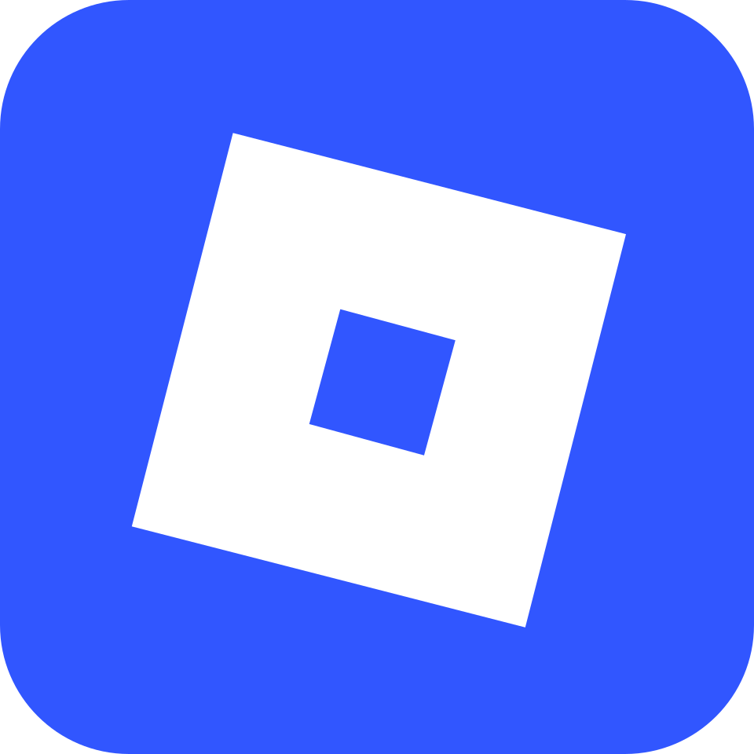
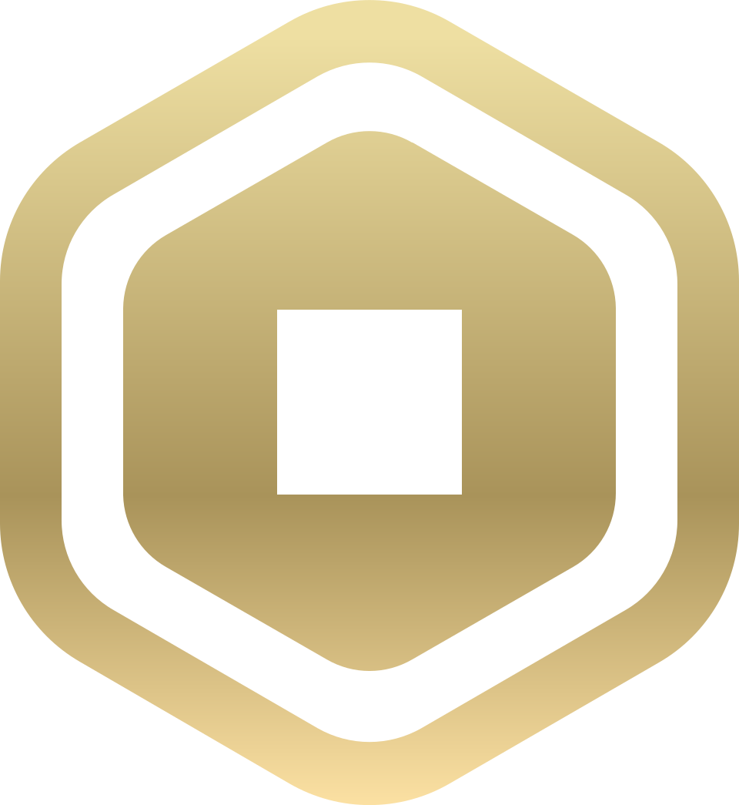
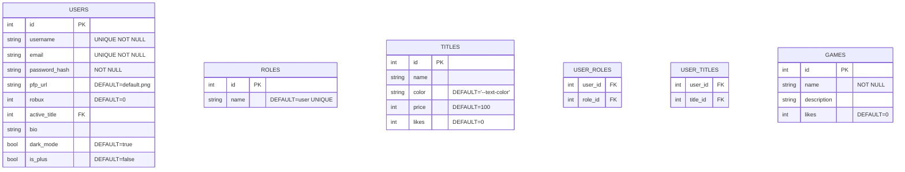

# 🔷 Roprepo - Um clone de Roblox com PHP

## 💻 Introdução

Um projeto web com PHP Vanilla com o intuito buscar, de acordo com as preferências do estudante, um tópico de interesse que esteja dentro das adequações do CRUD (Create, Read, Update, Delete) - As 4 operações básicas de um Banco de Dados. Este repositório escolheu imitar a interface padrão do Roblox.

## 🧠 Contextualização

Roblox é uma plataforma de jogos online e um sistema de criação de jogos desenvolvido pela Roblox Corporation que permite aos usuários programar e jogar jogos criados por eles próprios ou por outros usuários. Foi criado por David Baszucki e Erik Cassel em 2004 e lançado ao público em 2006. Em fevereiro de 2025, a plataforma registrava uma média de 85.3 milhões de usuários ativos diários. Segundo a empresa, sua base mensal de jogadores inclui metade de todas as crianças norte-americanas com menos de 16 anos. Fonte: [Wikipedia](https://pt.wikipedia.org/wiki/Roblox)

## 🛑 Aviso de Isenção de Responsabilidade (Disclaimer)

**Este é um projeto estritamente acadêmico e sem fins lucrativos.** O **Roprepo** é um clone conceitual desenvolvido exclusivamente para fins de estudo de desenvolvimento web (PHP, Banco de Dados e operações CRUD). 

* **Sem Vínculo Oficial:** Este projeto não é afiliado, associado, autorizado, endossado ou de qualquer forma conectado oficialmente à Roblox Corporation, ou a qualquer uma de suas subsidiárias ou afiliadas.
* **Propriedade Intelectual:** O nome "Roblox", bem como marcas registradas, logotipos e identidades visuais mencionadas ou utilizadas neste repositório são de propriedade exclusiva de seus respectivos donos. Este projeto utiliza tais elementos sob o princípio de *Fair Use* (Uso Justo) para fins educacionais.
* **Monetização:** Não há transações financeiras reais nesta aplicação. O sistema de "Robux" e "Assinatura Plus" mencionado é puramente simulado por meio de lógica de programação local e banco de dados fictício.

## 📄 Planejamento Inicial

A aplicação buscará seguir as funcionalidades básicas da página web [Roblox](https://roblox.com), como sistema monetário (Robux), usuários únicos e jogos, que neste caso, serão experimentados pelo navegador e sem a possibilidade de serem criados pelos próprios jogadores.

## 🩻 Estrutura Estética

O site deverá seguir os elementos visuais encontrados no Roblox, como por exemplo a fonte `Builder Sans`, Ícones (Logo, Robux, Assinatura Plus), exibidos abaixo:

    
    
    

## 📑 Páginas Existentes

### 🔐 Cadastro/Login

Para usuários que não possuem uma sessão atual e devem criar uma conta para prosseguir.

### 🏠 Home/Início

Esta será a página onde o usuário poderá ver seu nome de usuário e título, assim como os jogos disponíveis para acesso.

### 🎮 Jogos

Estas possuirão a possiblidade do usuário jogar experiências relativamente simples, com o intuito de obter pontos.

#### 🔴 Pong - Solo

Com o objetivo de não deixar a bola cair no chão, o jogador irá acumular pontos que no fim serão multiplicados por 0,35 para obter robux na plataforma.

#### 🎰 Cassino

Alto risco, alto ganho - O jogador poderá apostar os seus robux atuais para obter a chance de ganhar mais... Ou perdê-los.

#### 🐀 Jogo da Toupeira

Múltiplas entidades aparecerão na tela em questão de segundos. O objetivo é acertar o máximo de toupeiras possível antes que atinja um alvo que encerre o jogo.

#### Outras Possibilidades (Brainstorming)

##### Pedra, Papel, Tesoura

O jogador escolherá entre as três possibilidades, e o computador sorteará um número de 0 a 2 para enfrentá-lo. Ao vencer, o usuário ganhará 5 pontos, ao perder perderá 2 pontos e ao empatar, nenhum ponto será adicionado.

Os pontos ficarão guardados até que o jogo encerre de fato, para multiplicá-los finalmente por 0.15 pontos reais.

### ✒️ Pseudo-Assinatura Plus

Roblox Plus é o novo serviço de assinatura mensal da Roblox, lançado globalmente em 30 de abril de 2026, que substitui o Roblox Premium como a opção principal para novos usuários. O plano custa US$ 4,99 (ou R$ 29,90 no Brasil) por mês e foi projetado para ampliar o valor dos Robux através de benefícios exclusivos e descontos diretos.

Para o Roprepo, esta página será acessível através do usuário e obtida após o jogador coletar 2000 Robux.

### 👤 Perfil de Usuário

O usuário poderá fazer customizações simples com foto de perfil selecionável, biografia personalizada e a opção de escolher qual título entre os adquiridos deseja utilizar.

Por se tratar de um clone da plataforma, a assinatura Plus terá uma página dedicada e poderá somente ser adquirida caso o jogador possua robux o suficiente obtidos através dos jogos - 1000 Robux

## 🧩 Modelagem de Dados

## 🔧 Requisitos Técnicos

### Requisito 1 - Consistência e Reaproveitamento de Código

O desenvolvimento utilizará `/includes` como maneira de reutilizar elementos HTML existentes em (quase) todas as páginas, com o PHP replicando o conteúdo para o cliente.

### Requisito 2 - Cadastro Obrigatório

Todo usuário no qual não possui sessão atual ao sistema atribuído a uma tupla cadastrada do banco de dados não poderá acessar as funcionalidades do sistema.

### Requisito 3 - Sistema Monetário/de Pontuação (Robux)

Ao se deparar com os jogos existentes nos charts, o usuário conseguirá obter pontos com o progresso obtido e utilizar esta pontuação para adquirir cosméticos de títulos do catálogo ou Roprepo Plus.

### Requisito 4 - Contas de Usuário

Todo usuário deverá possuir por padrão, porém não limitado a:

* Cargo `user` para restringi-lo a permissões privilegiadas. Ex: Manipular o BD
* Título `player` como padrão
* Foto de Perfil `default.png` caso não haja personalização do próprio usuário.
* Total de 0 `robux` iniciais
* `dark_mode` habilitado
* Roprepo `plus` desabilitado

## ⚒️ Ferramentas

Priorizando a documentação concisa, o projeto utilizará as seguintes ferramentas:

* VS Code - IDE com Snippets PHP
* Figma - Prototipagem das Páginas
* HTML - Estruturação HTTP
* CSS - Estilização condizente à plataforma Roblox
* JS - Manipulação Frontend, como DOM
* Postgres - Persistência dos dados dos usuários e seus atributos
* PHP - Trata a lógica de credenciais (login e senha)

